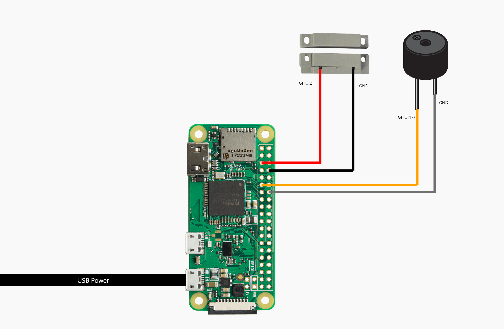
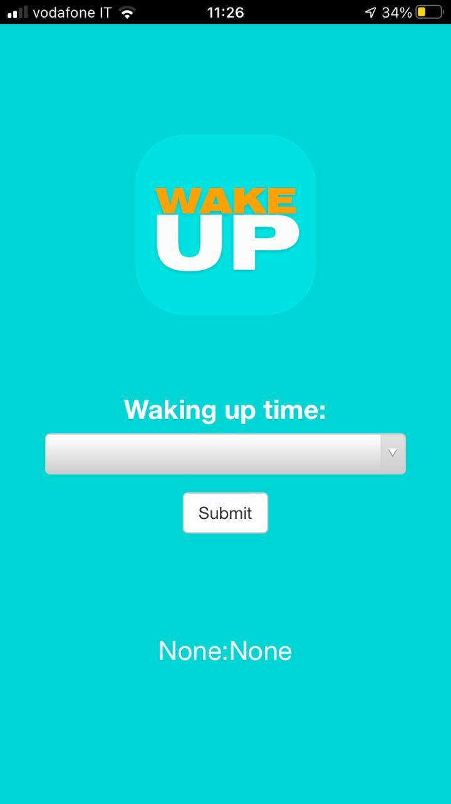
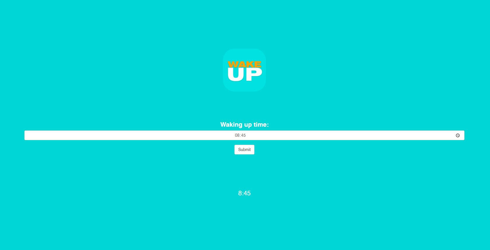

  

# **RPi Contact sensor wakeup alarm**
### Wakeup alarm that 'beeps' until some action is performed

Based on Flask, it creates a Web Server on a Raspberry Pi in which you can set the wakeup time, then at the decided time the Buzzer will ring until the contact sensor is closed (ex: foldaway bed) or 30 mins passed.

It's designed to work as a mobile web app, but can also be used from the Desktop browser.

# *Wiring schema*

  

# *Installation*

* Download or clone the code
* run `pip install -r requirements.txt`
* start with `python main.py`

# *Front-end screens*

  
  

